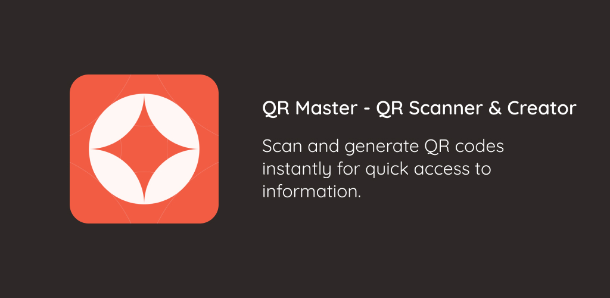
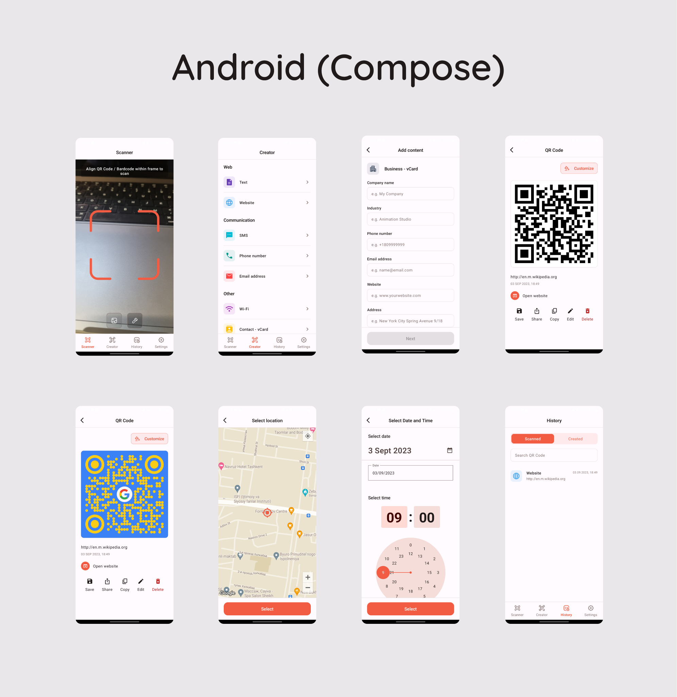
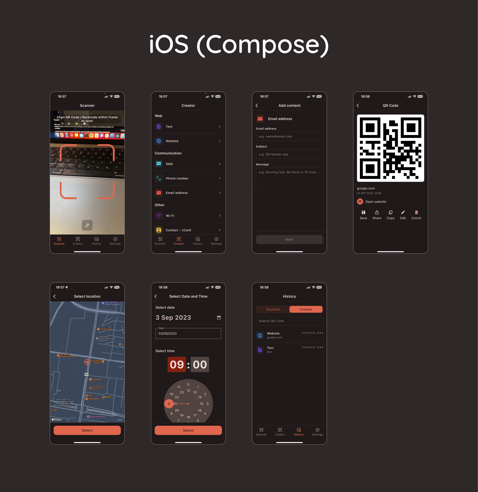

# QR Master - QR Scanner & Creator



## Table of Contents

- [Background Essay](ESSAY.md)
- [Project Overview](#project-overview)
- [Installation](#installation)
    - [Android](#android)
    - [iOS](#ios)
- [Key Features](#key-features)
- [Screenshots](#screenshots)
- [Technologies Used](#technologies-used)
- [License](#license)

---

## Project Overview

**QR Master** is a Compose Multiplatform application that seamlessly runs on Android and iOS
devices. It offers a comprehensive suite of features, including:

- QR code scanning
- QR code creation
- Customization of QR codes with colors, logos, and more
- History of scanned and created QR codes
- User-friendly settings for a personalized experience

With QR Master, users can effortlessly scan QR codes, generate their own with customization options,
and manage their history, all within a single, intuitive app.

## Installation

### Android

1. Clone the repository:
   ```
   git clone https://github.com/javokhirsavriev/qr-master.git
   ```

2. Open the project in Android Studio.

3. Build and run the app on your Android device.

### iOS

1. Clone the repository:
   ```
   git clone https://github.com/javokhirsavriev/qr-master.git
   ```

2. Open the project in Xcode.

3. Build and run the app on your iOS device or simulator.

## Key Features

- **QR Code Scanner**: Easily scan QR codes using your device's camera.
- **QR Code Creator**: Create customized QR codes with various options.
- **History**: View a history of scanned and created QR codes.
- **Settings**: Customize the app to suit your preferences.

## Screenshots




## Technologies Used

- Compose Multiplatform
- SQLDelight
- Voyager
- Google MLKit
- Maps

## License

This project is licensed under the [MIT License](LICENSE).